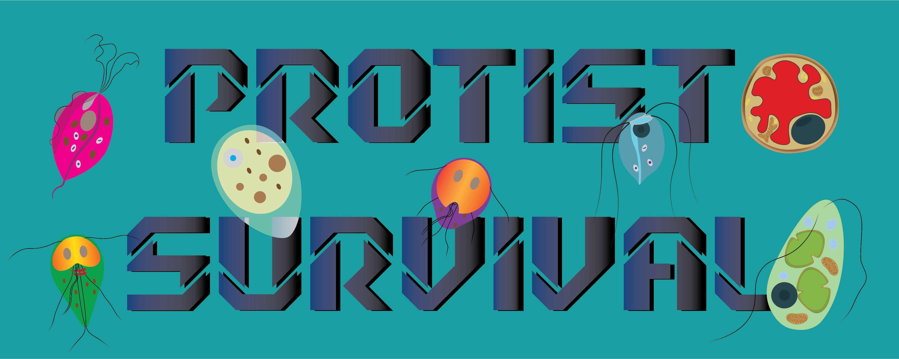
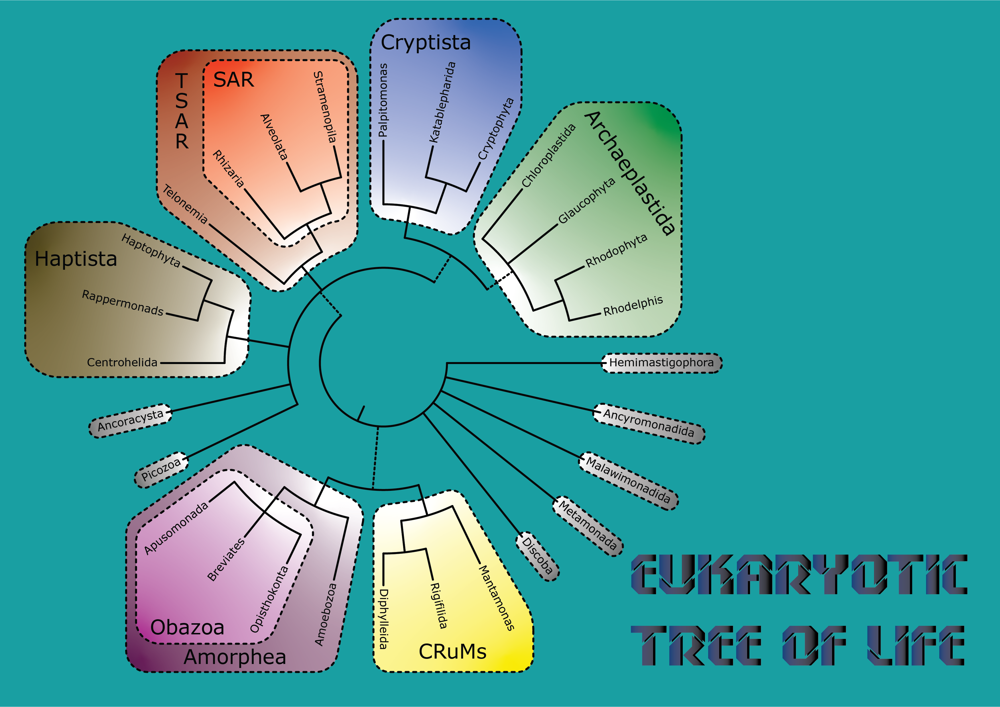

<p align="center">
  
</p>

Protists Survival is an educational arcade-style game where you play as a protist from different eukaryotic supergroups. Your goal is to survive as long as possible by collecting energy and avoiding dangers in a dynamic, scrolling environment inspired by real protist biology.

---

## Features

- **Playable Avatars:** Choose from a variety of protists, each with unique traits and backgrounds.
- **Dynamic Backgrounds:** Each protist has a specific background representing its natural habitat.
- **Energy & Danger:** Collect food molecules to score points and avoid dangers like oxygen and radicals.
- **Levels & Progression:** Survive longer to increase your level and game speed.
- **High Score Tracking:** Try to beat your best survival time and score.
- **Educational Content:** Learn about different protists and their lifestyles through info screens.

---

## Requirements

- Python 3.x
- [pygame](https://www.pygame.org/) library

---

### Recommended: Install with Conda

It is recommended to use a dedicated [conda](https://docs.conda.io/en/latest/) environment for the game:

```bash
# Create a new environment named 'protists' with Python 3.11 (or your preferred version)
conda create -n protists python=3.11

# Activate the environment
conda activate protists

# Install pygame (from conda-forge for best compatibility)
conda install -c conda-forge pygame
```

---

### Alternative: Install with pip

If you prefer pip, you can install pygame with:

```bash
pip install pygame
```

---

## How to Play

1. **Start the Game:**  
   Run the game with:
   ```bash
   python protists_game/protist_survival.py
   ```

2. **Select a Supergroup:**  
   Use your mouse to select a eukaryotic supergroup (currently only Metamonada is playable).
   <p align="center">
   
   </p>

3. **Pick Your Protist:**  
   Hover over a protist to see its info and click to select it as your avatar.
   <p align="center">
   
   </p>


4. **Survive!**  
   - Use the arrow keys to move your protist.
   - Collect energy molecules to increase your score.
   - Avoid dangers to stay alive.
   - Press `SPACE` to replenish your danger defence (costs points).
   - The game ends when you lose all lives.

---

## Controls

- **Arrow Keys:** Move your protist (left, right, up, down)
- **Spacebar:** Replenish danger defence (costs score)
- **Q or ESC:** Quit the game
- **Enter/Return:** Advance from intro and game over screens
<p align="center">

</p>


---

## Project Structure

```
protists_game/
    danger.py
    energy.py
    game_stats.py
    group_polygons.py
    high_score.txt
    moving_entity.py
    protist_survival.py
    protists.py
    scoreboard.py
    settings.py
    images/
        backgrounds/
        food/
        danger/
        metamonada/
        screen_images/
```

---

## Credits

- Game design and code: Alejandro Jiménez-González
- Protist illustrations and backgrounds: Alejandro Jiménez-González

---

## License

This project is for educational and non-commercial use.  
See [LICENSE](LICENSE) for details.

---

Enjoy learning and surviving as a protist!